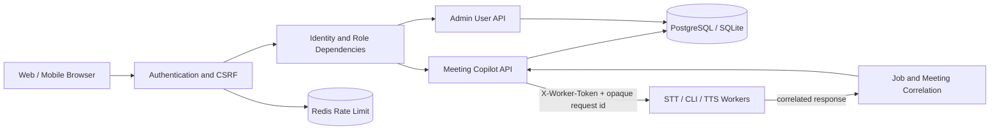

# Meeting Copilot 帳號權限與資料隔離計畫

## 1. 目標

建立可實際執行的帳號與權限模型：

- 第一位管理員仍由 localhost bootstrap 建立。
- 只有 `admin` 可以建立、停用、重設使用者帳號。
- 一般使用者只能看到及操作自己的專案、會議、逐字稿、建議、決策、行動項目、知識文件與匯出內容。
- `admin` 管理帳號與系統設定，但預設不能查看其他使用者的會議資料。
- PostgreSQL 與 SQLite 使用相同的授權行為。
- 所有資料隔離由後端強制執行；前端隱藏選單只負責使用體驗，不作為安全控制。

## 2. 範圍與非目標

### 本期範圍

- 帳號密碼登入。
- `admin`、`user` 兩種角色。
- 管理員建立、停用、啟用、重設密碼及撤銷 session。
- 使用者修改自己的顯示名稱與密碼。
- 使用者層級的完整資料隔離。
- 使用者層級的 UI 語言與個人設定。
- HTTP、WebSocket、音訊、匯出及搜尋的相同授權規則。
- 權限與帳號異動 audit event。

### 非目標

- 專案分享、共同編輯或跨使用者群組。
- 管理員 impersonation。
- OAuth、OIDC、LDAP、SSO。
- 使用者自行註冊或電子郵件寄送邀請。
- 細粒度 ACL，例如單一會議的 viewer/editor 權限。

需要協作功能時，另行加入 membership/ACL，不在第一版提前建立空泛模型。

## 3. 核心決策

### 3.1 嚴格私人資料

每筆業務資料只能屬於一位使用者。`admin` 的角色能力只涵蓋帳號與全域系統管理，不會繞過資料 ownership。

理由：

- 符合「使用者都是自己獨立的頁面資料」。
- 降低管理員帳號遭入侵時的資料暴露範圍。
- 日後若要支援分享，可以明確增加授權關係，不必依賴隱含的 admin 全讀權。

### 3.2 認證資料與使用者資料分離

新增 `users` 作為應用程式使用者；現有 `auth_credentials` 僅保存密碼雜湊並以 `user_id` 連到 `users`。

不把 profile 欄位繼續塞入 `auth_credentials`，避免帳號狀態、角色與密碼材料混在同一個模型。

### 3.3 登入後一律需要 identity

`remote_auth_required` 不再控制是否需要登入。資料庫中只要存在一位 user，localhost、reverse proxy 與同網域 IP 的所有業務 API 都必須登入。

原因是資料隔離必須能取得明確的 `user_id`；匿名 localhost 無法安全判定資料 owner。

升級規則：

- 尚無 user：只開放 health、auth status 與首次 bootstrap。
- 已有 user：所有非公開 endpoint 一律要求 active session。
- 既有 `MC_REMOTE_AUTH_REQUIRED=false` 在第一個相容版本只產生 deprecated warning，不再關閉認證；下一個版本移除設定欄位。
- 不設置第二個可繞過認證的 feature flag，避免部署狀態與資料 ownership 脫鉤。

### 3.4 Bootstrap 與 reverse proxy 信任邊界

首次管理員 bootstrap 只允許以下兩條路徑：

1. 瀏覽器以 `localhost`、`127.0.0.1` 或 `[::1]` 作為原始 Host 連到 reverse proxy；proxy 必須原樣轉送 `$http_host`。
2. 主機管理者執行一次性 CLI：

   ```bash
   docker compose run --rm backend python -m app.cli bootstrap-admin
   ```

後端先以標準 URL parser 移除 Host 的 port 與 IPv6 brackets，再依原始 `Host` allowlist 判定瀏覽器 bootstrap。不使用 `X-Forwarded-For`、`X-Real-IP` 或任意 client 可偽造的 forwarded header 授權。backend port 不對 host 公開，因此正常流量只能經過專案 reverse proxy。

兩條路徑都必須先以資料庫 transaction 確認 user count 為 0；建立完成後任何 bootstrap 請求都回傳 `409`。CLI 從 TTY 讀取密碼，不接受命令列參數，避免密碼出現在 shell history 或 process list。

### 3.5 以 aggregate root 保存 owner

直接在下列根資料表保存 `owner_user_id`：

- `projects`
- `meetings`
- `knowledge_documents`

其餘資料由父層關係推導 owner：

- project 子資料：`project_glossary`、`project_memory`
- meeting 子資料：participants、transcripts、states、Codex runs、suggestions、decisions、questions、risks、actions、events、audio chunks

這避免在每張子表重複 owner 並產生不一致。清單查詢透過父表 join 過濾。

### 3.6 Worker trust domain 與 owner 傳遞

STT、CLI engine 與 TTS worker 繼續只接受 `X-Worker-Token`，不接收 browser cookie，也不模擬 user session。

採 reviewer 所列的 **方案 B：worker 只用 callback/worker token，owner 由 backend 依 meeting 關係驗證**。目前 worker 呼叫是 backend 到 worker 的同步 request/response；worker 不直接連資料庫，也不回呼一般業務 endpoint。ownership 契約如下：

1. browser request 先由 backend 驗證 user 與 owned meeting。
2. backend 建立內部 `WorkerJobContext(request_id, meeting_id, owner_user_id)`；context 保留在 backend，`owner_user_id` 不傳給 worker。
3. worker request 只帶運算所需內容與 opaque `X-Request-ID`，使用 `X-Worker-Token` 認證。
4. worker response 回來後，backend 以自己的 context 重新查詢 meeting；確認 `meeting.owner_user_id == context.owner_user_id` 才寫入。
5. engine job 另外驗證 `CodexRun.id == request_id` 且 `CodexRun.meeting_id == meeting_id`。
6. owner 永遠以資料庫為準；worker payload schema 不提供 user id 欄位。

各 worker 的處理方式：

| Worker | Correlation | DB 寫入者 |
|---|---|---|
| STT | backend audio coroutine 保存 request id、meeting id、owner snapshot；response 後重查 meeting | backend |
| CLI engine | `CodexRun.id` + `meeting_id`；run row 推導 owner | backend |
| TTS | 呼叫前先用 suggestion -> meeting 驗證 owner；worker 只回傳 audio | 無業務 DB 寫入 |

未來若改成非同步 callback，只能新增 `/api/internal/workers/...` 路由，使用 worker token 並帶 opaque job id；backend 由 job row 查出 meeting 與 owner。worker 不得呼叫 `/api/meetings`、`/api/transcripts`、`/api/suggestions` 等 user endpoint。

## 4. 高階架構



請求授權順序：

1. 從 `mc_session` cookie 取得 session。
2. 驗證 session 是否存在、未過期、使用者仍為 active。
3. 非唯讀 HTTP 方法驗證 CSRF。
4. 檢查 endpoint 所需角色。
5. 所有業務查詢加入 `owner_user_id == identity.user_id`。
6. 找不到或不屬於目前使用者的資源統一回傳 `404`，避免洩漏資源是否存在。

worker response 不走上述 user dependency；它先通過 worker token，再由 job/meeting correlation 恢復資料 ownership。

## 5. 資料模型

### 5.1 users

| 欄位 | 型別 | 說明 |
|---|---|---|
| `id` | UUID string | 主鍵 |
| `username` | string(100) | 登入名稱，正規化後唯一 |
| `display_name` | string(100) | 畫面顯示名稱 |
| `email` | string(254), nullable | 選填，正規化後唯一 |
| `role` | string(20) | `admin` 或 `user` |
| `status` | string(20) | `active` 或 `disabled` |
| `must_change_password` | boolean | 初始或重設密碼後為 true |
| `created_by_user_id` | FK users, nullable | bootstrap admin 為 null |
| `last_login_at` | datetime, nullable | 最近成功登入 |
| `created_at` | datetime | 建立時間 |
| `updated_at` | datetime | 更新時間 |

資料庫限制：

- `role IN ('admin', 'user')`
- `status IN ('active', 'disabled')`
- username 使用 trim + lowercase 後比較。
- 不允許停用最後一位 active admin。

### 5.2 auth_credentials

| 欄位 | 說明 |
|---|---|
| `id` | credential 主鍵 |
| `user_id` | 唯一 FK `users.id`，刪除 user 時 cascade |
| `password_hash` | Argon2id hash |
| `password_changed_at` | 密碼更新時間 |
| `created_at` / `updated_at` | 時間欄位 |

不保存明文密碼、臨時密碼或可逆密碼。

為了支援安全 downgrade，第一個 multi-user release 暫時保留 legacy `auth_credentials.username` 與 `role`。`users` 是授權 source of truth；建立使用者、修改 username 或 role 時，由同一個 DB transaction 同步 legacy 欄位。任何不同步都視為 integrity error，登入不得繼續。

### 5.3 auth_sessions

保留雜湊 session token，新增：

- `user_id` 或由 credential join 取得 user。
- `revoked_at`，支援停用帳號或重設密碼後撤銷所有 session。
- 可選的 `user_agent_hash` 與 `ip_prefix` 只用於安全稽核，不保存 cookie 或 authorization header。

### 5.4 user_preferences

新增獨立表，避免把個人設定混入全域 `app_settings`：

| 欄位 | 說明 |
|---|---|
| `user_id` | PK/FK users |
| `ui_language` | UI 語言 |
| `settings_json` | 個人語言、分析與 TTS 偏好 |
| `created_at` / `updated_at` | 時間欄位 |

全域 GPU、Provider、Codex CLI、STT、TTS 與系統設定仍保存在 `app_settings`，只有 admin 可修改。

`settings_json` 第一版只允許後端 schema 明列的個人欄位：

- 輸入、逐字稿、翻譯、建議、摘要、匯出與 TTS 語言。
- 分析間隔、最少字元、建議 cooldown、context 上限。
- 自動分析、自動朗讀、TTS voice/rate/volume。

使用 allowlisted Pydantic schema，不接受任意 JSON key。Provider、worker URL、模型、secret reference 與 repository allowlist 不得出現在 personal preferences。

### 5.5 業務資料 ownership

新增非空 FK 與索引：

```text
projects.owner_user_id             -> users.id
meetings.owner_user_id             -> users.id
knowledge_documents.owner_user_id  -> users.id
```

建議索引：

```text
(owner_user_id, updated_at)
(owner_user_id, created_at)
(owner_user_id, status)
```

`IdempotencyRecord.scope` 必須包含 user id，例如：

```text
meeting-create:{user_id}
```

避免不同使用者使用相同 idempotency key 時取得對方資源。

既有 `idempotency_records` 加上 legacy admin user scope；若無法安全判定 owner，migration 只刪除該筆短期 dedup record，不影響 meeting。新版本不使用缺少 user id 的 legacy scope 進行 lookup。

## 6. 權限矩陣

| 功能 | admin | user |
|---|---:|---:|
| 登入、登出、修改自己的密碼 | 是 | 是 |
| 修改自己的顯示名稱與偏好 | 是 | 是 |
| 建立使用者 | 是 | 否 |
| 啟用、停用、重設其他使用者 | 是 | 否 |
| 修改角色 | 是 | 否 |
| 撤銷其他使用者 session | 是 | 否 |
| 查看其他使用者業務資料 | 否 | 否 |
| 操作自己的專案與會議 | 是 | 是 |
| 操作自己的知識、決策、任務 | 是 | 是 |
| Setup、Provider、CLI 登入、診斷 | 是 | 否 |
| 修改全域系統設定 | 是 | 否 |
| 查看自己的 dashboard 與歷史 | 是 | 是 |

## 7. API 設計

### 7.1 Self-service auth

```text
GET  /api/auth/status
GET  /api/auth/me
POST /api/auth/login
POST /api/auth/logout
POST /api/auth/change-password
PUT  /api/auth/me/profile
```

`/auth/status` 回傳：

```json
{
  "configured": true,
  "authentication_required": true,
  "authenticated": true,
  "user": {
    "id": "uuid",
    "username": "alex",
    "display_name": "Alex",
    "role": "user",
    "must_change_password": false
  }
}
```

密碼變更成功後撤銷其他 session，保留目前 session 或重新發 session。

`authentication_required` 固定表示「資料庫已有 user」，不再參考 host 或 `remote_auth_required`。

### 7.2 Personal preferences

```text
GET /api/preferences
PUT /api/preferences
```

- 兩者都要求 active user。
- GET 在 row 不存在時回傳由全域 default 產生的完整 preference object，但不立即寫 DB。
- PUT 只更新目前 user 的 row，使用完整 Pydantic schema 驗證。
- response 帶 version；PUT 必須帶目前 version，版本不符回 `409`，避免兩個頁籤互相覆蓋。
- `ui_language` 儲存在同一 row；成功後前端 invalidate preferences 與 i18n query。

現有 `/api/settings` 在同一 release 內拆分：

- frontend 個人設定全部改用 `/api/preferences`。
- Setup 與全域設定改用 `/api/admin/settings`。
- `/api/settings` 暫時回傳 `410 Gone`，不再混合個人與全域資料。

### 7.3 Admin user management

所有 endpoint 使用 `require_role("admin")`：

```text
GET   /api/admin/users
POST  /api/admin/users
PATCH /api/admin/users/{user_id}
POST  /api/admin/users/{user_id}/reset-password
POST  /api/admin/users/{user_id}/revoke-sessions
```

不提供 hard delete。使用 `status=disabled` 保留資料與 audit 關係。

建立使用者流程：

1. admin 輸入 username、display name、email（選填）與 role。
2. 後端產生至少 20 字元的隨機臨時密碼。
3. 資料庫只保存 Argon2id hash。
4. 明文臨時密碼只在建立成功 response 顯示一次，不寫 log、audit 或資料庫。
5. 使用者首次登入後必須先修改密碼，才可進入業務頁面。

重設密碼採相同的一次性顯示流程，並立即撤銷該使用者所有既有 session。

### 7.4 業務 API

所有既有業務 endpoint 都必須取得 `CurrentUser`，不能接受前端提交 `owner_user_id`。

範例：

```python
select(Project).where(
    Project.id == project_id,
    Project.owner_user_id == current_user.id,
)
```

子資料範例：

```python
select(TranscriptSegment).join(Meeting).where(
    TranscriptSegment.id == segment_id,
    Meeting.owner_user_id == current_user.id,
)
```

必須涵蓋：

- Projects、glossary、project memory
- Meetings、audio、transcripts、events、WebSocket
- Codex runs、suggestions、TTS
- Decisions、actions、questions、risks
- Knowledge documents 與跨來源搜尋
- Summary、analytics、所有 export 格式
- Dashboard、history 與 diagnostics 中的業務統計

### 7.5 系統管理與診斷 API

以下功能限制為 admin：

- Provider CRUD/test/default/toggle
- Codex CLI login/logout/test
- Setup 系統設定
- 全域 STT/TTS 設定
- `/api/admin/diagnostics`
- `/api/admin/metrics`
- `/api/admin/diagnostics/bundle`
- `/api/admin/diagnostics/migrations`

`health/live/ready` 只回傳最小健康資訊，不包含資料量、使用者資訊或敏感設定。

一般使用者統計不放在 diagnostics：

```text
GET /api/me/stats
GET /api/meetings/{meeting_id}/analytics
```

`/api/me/stats` 只聚合目前 user 的 meeting、action 與 suggestion。meeting analytics 必須先通過 owned meeting loader。系統診斷與個人工作統計因此是兩組 endpoint；user dashboard 不需要 diagnostics 權限。

## 8. 後端授權結構

新增共用 dependency：

```text
get_current_user()
require_active_user()
require_role("admin")
```

新增 scoped resource loader，集中處理 ownership：

```text
require_owned_project()
require_owned_meeting()
require_owned_document()
require_owned_decision()
require_owned_action()
```

禁止在 endpoint 使用未加 owner 條件的 `db.get()` 讀取業務資源。這個規則同樣適用 update、delete、export、audio 與 suggestion conversion。

backend 內部 background task 不持有 request-scoped user session。它只能使用建立 task 時保存的 `meeting_id/run_id`，並在每次寫入前呼叫 internal loader：

```text
require_job_meeting(job_id, meeting_id, expected_owner_user_id)
```

loader 從 DB 驗證 run、meeting 與 owner 關係。`expected_owner_user_id` 只用來偵測 job context 被竄改；最終 owner 仍以 DB row 為準。STT、engine、TTS response handler 不得直接以 payload 的 user id 寫資料。

WebSocket 在 accept 前完成：

1. origin 檢查。
2. session 驗證。
3. active user 檢查。
4. meeting ownership 檢查。

失敗直接關閉，不進入 audio/event loop。

worker service 的 `/v1/*` endpoint 維持 `X-Worker-Token`，不套用 `CurrentUser`。它們只做計算及回傳結果，不提供任何 Meeting Copilot DB CRUD。

## 9. 前端設計

### 9.1 登入

- bootstrap 完成後，所有來源都顯示登入 gate。
- 初次登入且 `must_change_password=true` 時，只能進入修改密碼頁。
- 登出後清除 React Query cache，避免下一位使用者在同一瀏覽器看到前一位快取。
- 登入成功也先清除 cache，再載入新 identity 的資料。
- Query key 可加入 `user.id` 作為額外防護。

### 9.2 帳號權限管理頁

原「存取控制」頁依角色呈現：

Admin：

- 使用者列表：username、display name、role、status、建立時間、最近登入。
- 搜尋與 role/status 篩選。
- 「建立使用者」modal。
- 啟用/停用。
- 重設密碼並一次顯示臨時密碼。
- 撤銷 session。
- 修改 role；禁止移除最後一位 active admin。

一般使用者：

- 個人資料。
- 修改密碼。
- 查看自己的登入狀態與登出。

敏感操作使用專案既有自訂 modal，不使用 browser `confirm()`。

### 9.3 導覽與路由

- user 隱藏 Setup、模型與端點、CLI 登入、診斷等 admin 導覽。
- admin 顯示完整系統管理導覽。
- 前端 route guard 防止誤入，但真正授權仍由 API 執行。
- 收到 `401` 導向登入；收到 `403` 顯示無權限；owned resource 的 `404` 顯示不存在。

## 10. 安全控制

- 密碼使用 Argon2id；最低 12 字元，允許 password manager 產生長密碼。
- 登入回應使用相同的 generic error，不揭露 username 是否存在。
- 登入 rate limit 使用 Redis atomic Lua `INCR + EXPIRE` fixed window：
  - 每個來源 IP：15 分鐘最多 20 次。
  - 每個 normalized username 的 HMAC：15 分鐘最多 10 次。
  - bootstrap：每個來源 IP 15 分鐘最多 5 次。
  - admin 建立/重設密碼：每位 admin 15 分鐘最多 20 次。
- 任一門檻超過即回 `429` 與 `Retry-After`，錯誤內容不揭露 username 是否存在。
- 登入成功只清除 username bucket，不清除 IP bucket，避免攻擊者用一組有效帳號重置來源 IP 限制。
- Redis 無法連線時，登入、bootstrap、建立使用者與重設密碼採 fail-closed 回 `503`；既有已驗證 session 與一般業務操作不受影響。`ready` 顯示 degraded，log 只記錄 rate-limit backend unavailable，不記錄 username 或密碼。
- username bucket 使用獨立 Docker secret `MC_RATE_LIMIT_HMAC_KEY_FILE` 計算 HMAC-SHA256，不重用 worker token。reverse proxy 原樣覆寫 `X-Real-IP`；因 backend port 不發布到 host，rate limiter 只信任來自 app-internal reverse proxy 的該 header，其他 peer 一律使用 socket peer IP。
- session cookie：`Secure`、`HttpOnly`、`SameSite=Strict`。
- CSRF cookie 及 `X-CSRF-Token` 雙重驗證保留。
- 停用帳號、重設密碼及 role 變更後撤銷 session。
- 不在程式、log、audit、DB 保存 session token、CSRF token、臨時密碼或 Codex credential。
- audit 記錄 actor user id、action、target user id 與結果，不記錄密碼。
- 管理員不能停用自己或最後一位 active admin。
- 所有回傳的使用者資料排除 password hash 與 session token hash。

主要威脅與控制：

| 威脅 | 控制 |
|---|---|
| 使用 ID 存取別人的 meeting | scoped query + 404 |
| 修改 payload 偽造 owner | schema 不接受 owner_user_id |
| knowledge search 混入他人資料 | 每一個 union/source query 都加 owner filter |
| WebSocket 竊聽他人逐字稿 | handshake 前驗證 session 與 meeting owner |
| admin endpoint 垂直越權 | `require_role("admin")` |
| 停用帳號仍持有 session | active check + session revoke |
| 共用瀏覽器殘留資料 | 登入/登出清除 query cache |
| 暴力登入 | Redis rate limit + generic 401 |

### 10.1 Audit 相容模型

現有 `audit_events.actor` 字串保留為不可變的顯示快照，新增：

```text
actor_user_id  nullable FK users.id ON DELETE SET NULL
target_user_id nullable FK users.id ON DELETE SET NULL
outcome        success | denied | failed
```

規則：

- 新的 user action 同時寫 `actor_user_id` 與當下 username 到既有 `actor`。
- system/worker event 的 `actor_user_id` 為 null，`actor` 使用固定 service name。
- migration 以 normalized username 對應既有 actor；無唯一對應時保留 actor 字串並讓 FK 為 null。
- 不重新解釋或刪除舊 audit row。
- downgrade 只移除新增 FK/outcome 欄位，既有 `actor` 仍完整，因此歷史 audit 不會遺失。

## 11. 既有資料遷移

採兩個 additive Alembic revision，PostgreSQL 與 SQLite 都必須通過實際 upgrade/downgrade 測試。

### 11.1 Upgrade preflight

升級前檢查：

- 若已有 business data 但沒有 `auth_credentials`，停止 migration，要求先以舊版 localhost bootstrap 或 CLI 建立 admin。
- 每個 credential username 必須能正規化成唯一值；碰撞時停止並列出 credential id，不自動合併。
- legacy business data 的承接者固定為 `created_at` 最早的 admin credential。
- 找不到 admin 時停止，不隨機指派 owner。

### 11.2 Revision 0008：additive identity schema

1. 建立 `users` 與 `user_preferences`。
2. 每個現有 credential 建立對應 user。
3. `auth_credentials` 新增 nullable unique `user_id` 並回填。
4. 保留原本 `auth_credentials.username` 與 `role`；本 release 不刪欄位，以支援 downgrade。
5. `audit_events` 新增 nullable `actor_user_id`、`target_user_id`、`outcome`，保留原 `actor`。
6. root tables 新增 nullable `owner_user_id`。
7. 回填 projects、meetings、knowledge documents 至 legacy admin。
8. 依 meeting/project 關係驗證所有子資料都能推導相同 owner。
9. legacy `idempotency_records.scope` 加上 legacy admin id；無法判定者刪除 dedup row。

SQLite 的 FK、unique、not-null 變更全部使用 `op.batch_alter_table()`；測試不得只在 PostgreSQL 執行。

### 11.3 Revision 0009：enforce ownership

1. 驗證三個 root table 沒有 null owner。
2. 建立 owner FK 與複合索引。
3. 將 `owner_user_id` 改為 non-null。
4. 將 `auth_credentials.user_id` 改為 non-null。
5. 驗證每個 credential 恰好對應一位 user。

`auth_sessions` 繼續 FK 到 credential，identity 透過 credential join user；本期不做不必要的 session table 重寫。

### 11.4 Downgrade contract

舊 schema 無法表示多使用者 ownership，因此 downgrade 有明確 precondition：

- 只有一位 user，且所有 root data 都屬於該 user：允許完整 downgrade。
- 有多位 user 或多位 owner：拒絕 downgrade，提示先備份並用管理工具合併至單一 owner；不得靜默混合私人資料。

允許 downgrade 時：

1. 確認 credential 的 legacy username/role 與 user row 同步。
2. 移除 owner FK/index/columns，但保留所有 business rows。
3. 移除 credential `user_id`。
4. 移除 audit 新欄位；原 `actor` 保留。
5. 移除 preferences 與 users。

測試 fixture 必須記錄 upgrade 前每張表的 row count 與關鍵內容，downgrade 後逐筆比對。SQLite 也執行同一組驗證。

### 11.5 Release gate

schema、always-on authentication 與 ownership enforcement 可以分 milestone 開發，但在 Milestone 2 全部通過前：

- `/api/admin/users` 不註冊到 router。
- 前端不顯示建立使用者。
- 資料庫只能保有 migration 產生的 legacy admin user。

因此不會出現「已能建立第二位使用者，但部分 endpoint 尚未隔離」的部署狀態。

## 12. Implementation Sequence

### Milestone 1：Identity、migration 與認證基礎

- 完成 0008/0009 migration、preflight 與單一 user downgrade。
- `Identity` 改為包含 `user_id`、role、status。
- bootstrap 建立 user + credential。
- 移除 `remote_auth_required` 行為；有 user 後所有來源一律登入。
- 實作 Host allowlist bootstrap 與 Docker CLI fallback。
- 加入 active user、role dependencies。
- 實作 Redis rate limit、fail-closed 規則與 session revoke。
- 暫不註冊 admin user management API。

驗收：

- PostgreSQL migration upgrade/downgrade 測試。
- SQLite migration 與一個指令開發模式測試。
- bootstrap、login、logout、disabled user、expired/revoked session 測試。
- reverse proxy 下 localhost bootstrap、LAN bootstrap denied、偽造 forwarded header denied。
- Redis threshold、TTL、`Retry-After` 與 unavailable fail-closed 測試。

### Milestone 2：完整 ownership enforcement

- 三個 aggregate root 加入 `owner_user_id`。
- 所有 list/detail/create/update/delete 查詢加 owner scope。
- 修正 WebSocket、audio、export、analytics、knowledge search、background tasks。
- backend 保存 worker job owner context；worker 只收 opaque request id，response 寫入前重新驗證 DB。
- 實作 `/api/preferences` 與 `/api/admin/settings`，移除舊 `/api/settings` 語意。
- 拆分 admin diagnostics 與 `/api/me/stats`。
- admin-only 系統 endpoint 完成 role guard；仍不開放 user management。

驗收：

- 建立 user A 與 user B。
- 對每種資源測試 A 無法 list、read、update、delete、export、listen B 的資料。
- 跨使用者 ID 一律 404。
- user 呼叫 admin/system mutation 一律 403。
- knowledge search 與 dashboard 統計只包含自己的資料。
- worker token 不能讀寫一般 user endpoint；竄改 job owner/meeting correlation 必須失敗。
- 所有 endpoint inventory 完成，未 scoped 的 business `db.get()` 為零。

### Milestone 3：Admin 帳號管理 API

- Milestone 2 security gate 通過後才註冊 router。
- 實作 admin users API。
- 建立一次性臨時密碼流程。
- 啟用、停用、role 更新、reset password、revoke sessions。
- 加入 audit events。
- 禁止破壞最後一位 active admin。

驗收：

- user 無法呼叫任何 admin endpoint。
- 臨時密碼只回傳一次且不出現在 log/DB/audit。
- reset/disable 後舊 session 立即失效。
- race condition 下仍不能同時停用最後一位 admin。
- 新增第二位 user 後，multi-user downgrade 必須明確拒絕而非遺失 owner。

### Milestone 4：前端登入與帳號管理

- 更新 AuthGate，所有 host 統一登入。
- 實作首次修改密碼頁。
- 完成 admin 使用者管理頁。
- 完成一般使用者 profile/password 頁。
- 導覽與 route guard 依 role 顯示。
- 登入與登出清除 Query cache。
- 五語系完整翻譯。

驗收：

- Desktop 與手機版操作完整。
- 所有按鈕、modal、空狀態與錯誤狀態可運作。
- admin 與 user 各自走完整 E2E。
- 同瀏覽器先登入 A、登出後登入 B，不顯示 A 的快取資料。

### Milestone 5：安全與回歸驗證

- HTTP horizontal/vertical privilege escalation 測試。
- WebSocket ownership 與 origin 測試。
- CSRF、rate limit、session fixation、password reset 測試。
- secrets/log 掃描。
- 完整 backend tests、frontend tests/type/build。
- Docker Compose PostgreSQL、SQLite 開發模式、A6000 STT 流程回歸。

## 13. 完成定義

- admin 可以從 UI 建立與管理 user。
- user 首次登入必須更改密碼。
- 每位使用者的所有業務頁面只顯示自己的資料。
- 猜測其他使用者 resource id 不能確認其存在。
- admin 不會因角色而自動看到其他使用者業務資料。
- localhost 與 LAN 的授權行為一致。
- HTTP、WebSocket、audio、export、search 都有 ownership 測試。
- PostgreSQL 與 SQLite 測試通過。
- Docker Compose 可正常啟動，Codex token 與其他敏感資料不會被記錄或保存。

## 14. ADR 摘要

### ADR-001：採單一 owner，不先做共享 ACL

**狀態：** Proposed

**決策：** 每個 project、meeting、knowledge document 只屬於一位 user。

**替代方案：** 立即建立 organizations、groups、memberships 與 resource ACL。

**取捨：** 第一版不能分享，但模型簡單、可驗證，且符合目前需求。確定需要協作後再加入 membership。

### ADR-002：admin 不具備跨使用者資料讀取權

**狀態：** Proposed

**決策：** admin 管理帳號與系統，不繞過 ownership。

**替代方案：** admin 可查看所有內容。

**取捨：** 支援成本較高時無法直接查看使用者資料，但隱私與最小權限更清楚。

### ADR-003：使用 server-side session，不改用 JWT

**狀態：** Proposed

**決策：** 延續現有雜湊 session token、Secure HttpOnly cookie 與 CSRF。

**替代方案：** JWT access/refresh token。

**取捨：** server-side session 需要 DB 查詢，但能立即撤銷，適合目前單一部署與帳號停用需求，也避免引入不必要的 token lifecycle 複雜度。

### ADR-004：Worker 不攜帶 user session 或 owner id

**狀態：** Proposed

**決策：** worker 只接受 worker token 與 opaque request id；backend 保存 job owner context，並在寫入前由 DB meeting/run 關係恢復及驗證 owner。

**替代方案：** 將 user id 簽名後放入每個 worker payload，或把 user session 傳給 worker。

**取捨：** backend 多一次 ownership lookup，但 worker 無法偽造 owner，也不會擴大 browser session 的暴露範圍。

### ADR-005：Authentication 由 users 是否存在決定

**狀態：** Proposed

**決策：** 完成 bootstrap 後所有 host 一律登入；`remote_auth_required` 不再作為旁路。

**替代方案：** localhost 保持匿名，LAN 才登入。

**取捨：** localhost 多一步登入，但每個 request 都能取得唯一 user id，資料隔離不會因部署位址而失效。

### ADR-006：Migration 保留 legacy credential 欄位

**狀態：** Proposed

**決策：** 第一個 multi-user release 不刪除 `auth_credentials.username/role`；users 為 source of truth，兩者在 transaction 內同步。

**替代方案：** upgrade 立即刪欄位，再由 downgrade 重建。

**取捨：** 短期有少量重複欄位，但 downgrade 可驗證且不需要猜測舊資料，待 multi-user 版本穩定後再獨立移除。
